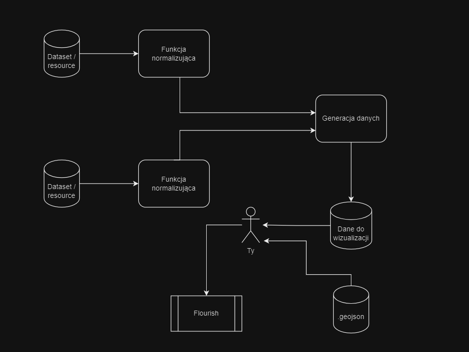

# see-open-data
English on request

see-open-data to projekt stworzony, aby w łatwy sposób przedstawiać i wizualizować dane pochodzące z www.dane.gov.pl.

Przykłady:

https://public.flourish.studio/visualisation/15959761/

https://public.flourish.studio/visualisation/15798657/

https://public.flourish.studio/visualisation/15686678/

#### Po co to?

Dane znajdujące się na www.dane.gov.pl mają różne struktury, różne formaty oraz przedstawiają jedynie wycinek rzeczywistości. Przykładowo jesteśmy w jednym miejscu pobrać informację o liczbie uczniów w każdym województwie, natomiast w innym miejscu o liczbie uczniów uczących się w domu. Aby pokazać jaki jest stosunek liczby uczniów uczących się w domu do liczby uczniów w województwie musimy pobrać obie dane oraz odpowiednio je zmanipulować, a jeśli chcemy, następnie jest przedstawić.
Projekt ten ma na celu stworzenie narzędzia do łatwego manipulowania danych oraz generowania danych wizualnych.

## Jak to działa?

### Datasets/resource oraz funkcje normalizujące

Datasets/resource są to dane pobrane ze strony www.dane.gov.pl.

Funkcja normalizująca to funkcja, która transformuje dane, aby były mogły być użyte następnie do stworzenia raportu.

Folder "datasets" zawiera ponumerowane "datasets" wraz z "resource". Mapuje się to bezpośrednio z www.dane.gov.pl. Przykładowo:
https://dane.gov.pl/pl/dataset/1963,nauczanie-domowe/resource/45532/table?page=1&per_page=20&q=&sort=
Oznacza, że funkcja normalizowania danych znajdująca się w 1963/45532 normalizuje dane znajdujące się w powyższym linku.

Na ten moment funkcje normalizujące jako wejście dostają pliki *.csv ściągnięte z www.dane.gov.pl, ale w przyszłości pojawaią się też takie, które wykorzystują API.

### Generacje danych oraz dane do wizualicji

Funkcja, która pobiera dane przetransformowane przez funkcje normalizujące. Może używać jednej lub wielu funkcji. Przykładowo funkcja znajdująca się w report/education/students-in-home wykorzystuje dwie funkcje normalizujące (212/45734 oraz 1963/45532) aby stworzyć raport.
Generacja danych na wyjściu daje dane do wizualizacji.

### Flourish

Na ten moment narzędzie skupia się na generowaniu danych do map dla Flourish (https://flourish.studio/)

## Jak mogę tego użyć?

Najłatwiej jest użyć dostępnych już funkcji generacji danych do wizualizacji, odpalając np. plik "reports/education/students-in-home.ts" i podając ścieżki do danych dla funkcji normalizujących. Wyjściowe dane należy użyć razem z plikiem .geojson odpowiednim dla danych (np. z folderu /other_data/geo/provinces-medium.geojson).

### Przykład

Odpalenie komendy:

<code>ts-node results/education/students-from-ukraine.ts studentsFromUkraine.csv allStudents.csv</code>

wygeneruje plik Regions.json. 

Następnie w Flourish wybrać "Projection Map" i jako "data" wczytać Regions.json do "Regions" oraz /other_data/geo/provinces-medium.geojson do "Regions_geometry".

## Implementacja

Implementację można zacząć w każdym miejscu, tzn.
1) Stworzyć funkcję normalizująca dane
2) Dodać dane do wyjścia funkcji normalizującej
3) Stworzyć funkcję generacji danych (raportu)
itd.

Każda funkcja normalizacji jest odseparowana i może wyglądać zupełnie inaczej. Warto jednak trzymać się następującej konwencji:
1) W przypadku pobierania danych z pliku, funkcja powinna posiadać ścieżkę do pliku jako argument
2) Funkcja powinna zwracać najlepiej Map<string, any>, gdzie "string" jest kluczem wykorzystywanym potem do generacji raportu. Np. wykorzystuje się "terytId" aby zmapować dane dla województw.

## Plany

- kolejne funkcje normalizujące oraz generowania danych
- wsparcie API aby zautomatyzować proces pobierania danych
- testy

## Współpraca

Pull requesty mile widziane.

Wsparcie komercyjne - labs@rsoftcon.com

## Sponsor

© 2023 RSC https://rsoftcon.com/
